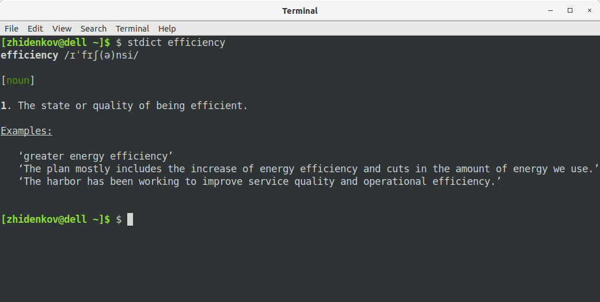

# What stdict is?
`stdict` is a console tool to lookup words in online Oxford Dictionary. `sdict` is written on Python and
requires Python 3 interpreter.

# Installation

## Using pip

```bash
$ sudo pip3 install -U stdict-0.1a0.tar.gz
```

## Build your own package

```
$ python3 setup.py sdist
$ cd dist && sudo pip3 install -U stdict-0.1a0.tar.gz
```

## Using setup.py file

```
$ sudo python3 setup.py install
```

# Usage example



# Options

```bash
$ sdict [options] <word>
```

Possible options are:

option | description 
---------|------------
--no-color | Do not colorize output
--examples `<count>` | Limit number of examples to display by `<count>`, default is 3
--noun | Show only nouns
--verb | Show only verbs
--adj | Show only adjectives
--adv | Show only adverbs

# Requiremets

* [Python Requests](http://docs.python-requests.org/en/master/)
* [lxml libray](https://lxml.de/)
